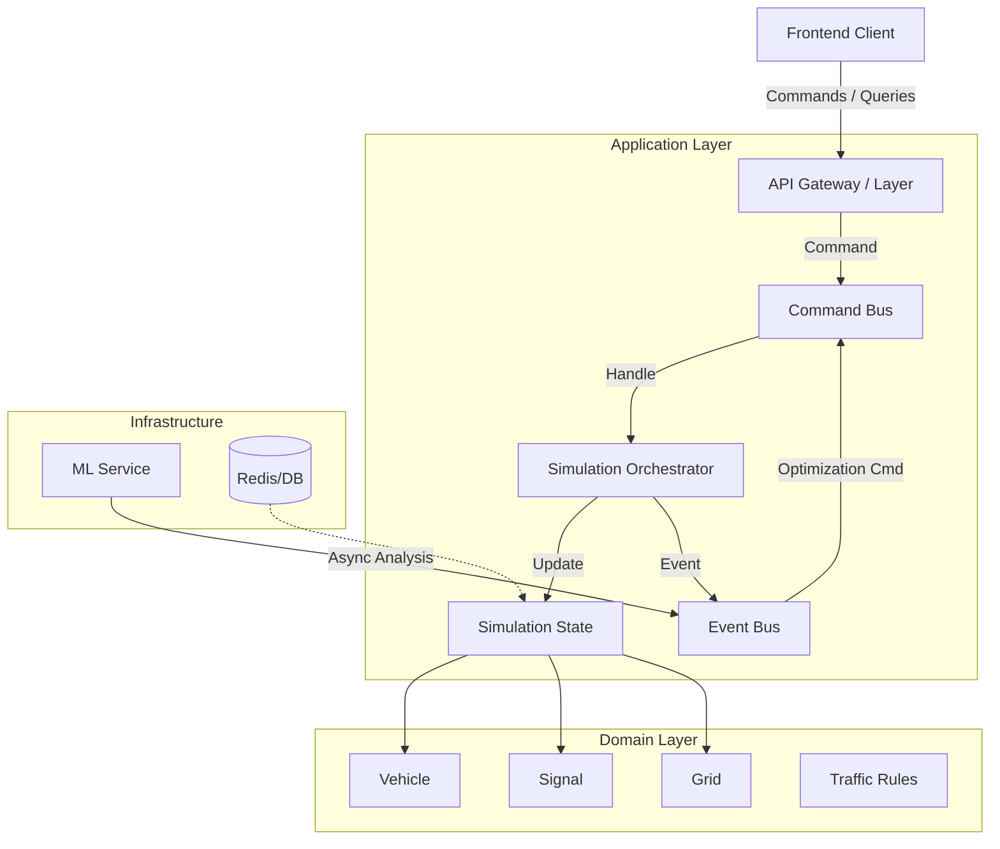

# SignalIQ Backend Architecture Review

**Date:** 2024-05-22
**Reviewer:** Senior Distributed Systems Architect

## 1. Executive Summary

This report provides a comprehensive analysis of the SignalIQ backend repository. The current implementation is a monolithic, mixed-architecture prototype built with FastAPI and an in-memory simulation loop. While functional for small-scale demonstrations, it lacks the structural integrity, determinism, and scalability required for a production-grade distributed traffic intelligence system.

This document outlines the current state, identifies critical risks, and proposes a phased refactor roadmap towards a clean, event-driven, and domain-centric architecture.

---

## 2. Current Architecture Analysis

### A. Folder Structure & Framework
- **Framework:** FastAPI (Python) serving as both the API layer and the simulation host.
- **Structure:**
  - `backend/main.py`: Entry point, API routes, and Simulation Loop task.
  - `backend/simulation/engine.py`: "God Object" `SimulationEngine` handling all logic (Vehicles, Signals, Emergency, AI).
  - `backend/simulation/models.py`: Pydantic models for API and internal state.
  - `backend/simulation/config.py`: Configuration constants.

### B. Architectural Pattern
- **Current Pattern:** **Monolithic / Mixed Layered**.
  - **Presentation Layer:** FastAPI routes in `main.py`.
  - **Domain/Logic Layer:** `SimulationEngine` in `engine.py`.
  - **Data Layer:** In-memory state within `SimulationEngine`.
- **Critique:** High coupling. The "Engine" mixes orchestration, business rules, and state management. No clear separation of concerns.

### C. Simulation Ownership
- **Owner:** **Backend**.
- **Mechanism:** An `asyncio` task (`run_simulation`) in `main.py` updates the engine state at ~20Hz.
- **Time Source:** `time.time()` (Wall-clock time). This makes the simulation non-deterministic and dependent on server load.

### D. Agent Lifecycle Management
- **Agents:** Vehicles and Emergency Vehicles.
- **Management:** Created and destroyed within `SimulationEngine` methods (`_spawn_vehicle`, `_update_vehicles`).
- **Issues:** Hardcoded logic for spawning and movement. No distinct "Agent" entities with independent behavior logic.

### E. Emergency Vehicle Handling
- **Logic:** Centralized in `SimulationEngine` (`start_emergency`, `_update_emergency_vehicle`).
- **Implementation:** Direct manipulation of signal states (`IntersectionMode.EMERGENCY_OVERRIDE`).
- **Risk:** Race conditions if multiple emergency vehicles exist (prototype only supports one). No prioritization logic for competing requests.

### F. ML Integration
- **Approach:** Tightly coupled Heuristic/Rule-based "AI".
- **Implementation:** `_run_ai_decision_engine` inside `engine.py`.
- **Issues:** Runs synchronously within the simulation loop. Blocking the loop for complex ML inference would degrade simulation performance.

### G. Concurrency & State Mutation
- **Concurrency Model:** Single-threaded AsyncIO.
- **State Authority:** `SimulationEngine` singleton.
- **Mutation:** API handlers call methods on the singleton which mutate state directly.
- **Risks:**
  - **Responsiveness:** Long-running simulation updates block API requests.
  - **Consistency:** No transactional integrity. If an update fails halfway, state might be inconsistent.

---

## 3. Critical Evaluation

### 3.1 Simulation Ownership & Time
- **Current:** Backend owns time, but uses wall-clock time (`dt = time.time() - start`).
- **Verdict:** **High Risk**. Simulation is non-deterministic. Replaying a scenario for debugging or ML training is impossible.

### 3.2 Emergency Logic
- **Current:** Simple override.
- **Verdict:** **Basic**. Lacks pre-emption (clearing the path *before* arrival) and restoration planning (smoothly returning to normal flow).

### 3.3 ML Integration Coupling
- **Current:** Embedded in the engine loop.
- **Verdict:** **Not Scalable**. ML inference should be asynchronous and decoupled (e.g., via a separate service or worker thread) to avoid stalling the physics engine.

### 3.4 Data Consistency & Desynchronization
- **Current:** In-memory only.
- **Verdict:** **Critical Risk**. Server restart loses all state. Frontend polls for state; network latency causes visual desynchronization (vehicles jumping).

---

## 4. Proposed Architecture

### A. Architectural Pattern: **Clean Architecture (Hexagonal) + CQRS**

We separate the system into:
1.  **Domain Layer:** Pure business logic (Entities: `Vehicle`, `Intersection`, `TrafficSignal`).
2.  **Application Layer:** Use Cases (Command Handlers, Simulation Orchestrator).
3.  **Infrastructure Layer:** API (FastAPI), Persistence (Redis/DB), External Services (ML).

### B. Logical Architecture Diagram



### C. Core Concepts

1.  **Command-Driven Domain Model:**
    -   All changes are Commands (e.g., `SpawnVehicle`, `ChangeSignalPhase`).
    -   The Engine processes a queue of commands each tick.

2.  **Deterministic Tick System:**
    -   Time advances in fixed discrete steps (e.g., `tick_id`, `dt=0.1s`).
    -   Logic uses `tick_id` not `time.time()`.
    -   Randomness is seeded (e.g., `random(seed + tick_id)`).

3.  **Centralized Priority Manager:**
    -   `EmergencyService` evaluates active emergency requests.
    -   It issues `OverrideSignalCommand` with high priority.

4.  **Separation of Read/Write Models (CQRS):**
    -   **Write Model:** The high-fidelity `SimulationState` used by the engine.
    -   **Read Model:** A simplified `GridSnapshot` optimized for frontend JSON serialization, updated at the end of each tick.

---

## 5. Refactor Roadmap

### Phase 1: Separation & Determinism (Foundation)
1.  **Extract Entities:** Move `Vehicle`, `Intersection` logic out of `engine.py` into `domain/entities/`.
2.  **State Encapsulation:** Create a `SimulationState` object that holds the entire grid state.
3.  **Tick Loop:** Rewrite `update(dt)` to use fixed `dt` and `tick_count`. Remove wall-clock dependency.
4.  **Command Pattern:** Implement basic `Command` interface for signal changes.

### Phase 2: Services & Events (Decoupling)
1.  **Event Bus:** Implement a simple internal Event Bus (`SignalChanged`, `VehicleArrived`).
2.  **Emergency Service:** Move emergency logic to `services/emergency.py`, listening for events or API calls.
3.  **Traffic Signal Service:** Move signal timing logic to `services/traffic_signal.py`.

### Phase 3: Scalability & ML (Production Ready)
1.  **ML Interface:** Define a strict API for the ML engine. Run ML in a separate process/container.
2.  **Persistence:** Save `SimulationState` snapshots to Redis/Database periodically.
3.  **WebSocket:** Replace polling with WebSocket broadcasting of `GridSnapshot`.

---

## 6. Specific Recommendations

### File/Folder Restructuring

```
backend/
├── api/                # Interface Adapters
│   ├── routes/
│   ├── dependencies.py
│   └── main.py         # App Entry
├── domain/             # Enterprise Business Rules
│   ├── entities/       # Vehicle, Intersection, Grid
│   ├── value_objects/  # Location, Velocity
│   └── services/       # Domain Services (Routing)
├── application/        # Application Business Rules
│   ├── commands/       # Command Handlers
│   ├── queries/        # Read Models
│   └── engine.py       # Simulation Orchestrator
├── infrastructure/     # Frameworks & Drivers
│   ├── persistence/
│   └── ml_client/
└── tests/
```

### Concurrency Control Strategy
- **Single Writer (The Engine):** Only the `SimulationOrchestrator` task writes to `SimulationState`.
- **Command Queue:** API threads push commands to a thread-safe queue. The Engine consumes them at the start of each tick.
- **Read-Copy-Update (RCU):** For API reads, the Engine publishes an immutable "Snapshot" at the end of each tick. API readers access the latest Snapshot without locking the engine.

### Backend/Frontend Boundary
- **Backend:**
  - Owner of Truth (Physics, Rules, State).
  - Broadcasts `GridSnapshot` (20Hz).
  - Accepts `Commands` (e.g., "Toggle AI", "Manual Override").
- **Frontend:**
  - Visualization only.
  - Interpolates positions between snapshots for smooth animation (client-side prediction).
  - Sends user intents as Commands.

---
